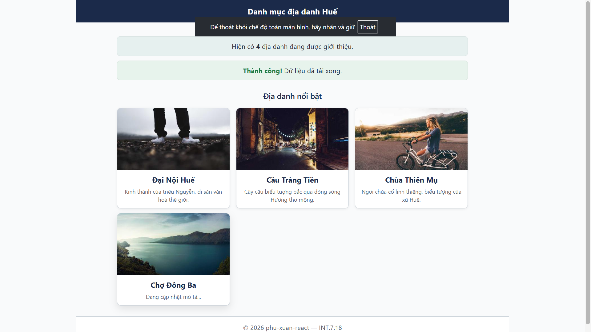

# phu-xuan-react — Bài 9

## Cài đặt & chạy
npm install
npm run dev

text

Mở http://localhost:5173

## Thành phần đã xây dựng

- **TheDiaDanh** — thẻ địa danh tái sử dụng qua props (có giá trị mặc định cho `moTa`)
- **The** — khung có `children` và thanh tiêu đề tùy chọn
- **BoCucTrang** — bố cục 3 khe JSX (header / main / footer)
- **DanhSach** — danh sách dùng mẫu render props (tách logic khỏi hiển thị)
- **HopThongBao** / **HopThongBaoThanhCong** — kết hợp & chuyên biệt hóa
- **TrangDanhMuc** — trang danh mục hoàn chỉnh lắp ghép từ các thành phần trên

## Giải thích thiết kế

### Vì sao chọn props/children cho từng thành phần?

- **TheDiaDanh** dùng **props** (`anh`, `ten`, `moTa`) vì dữ liệu có cấu trúc rõ ràng — mỗi trường là một kiểu dữ liệu cụ thể.
- **The** dùng **children** vì nội dung bên trong không biết trước — nơi gọi quyết định nhét gì vào (lưới, danh sách, đoạn văn...).
- **BoCucTrang** dùng **khe JSX** (3 prop JSX) vì có **3 vùng riêng biệt** (header / main / footer) — nếu dùng `children` thì không phân biệt được vùng nào.
- **DanhSach** dùng **render props** vì cần **tách logic khung (ul/li/key)** khỏi **cách hiển thị từng mục** — cho phép cùng dữ liệu hiển thị theo nhiều kiểu khác nhau.
- **HopThongBaoThanhCong** dùng **composition** (không kế thừa) để **chuyên biệt hóa** `HopThongBao` — chỉ ghi đè `mauNen` và thêm prefix "Thành công!".

## Ảnh chụp giao diện

Lab 5 — Thành phần tái sử dụng của riêng nhóm

### Nut — Nút đa biến thể

**Vì sao chọn props + children cho Nut?**

- **Props** (`loai`, `kichThuoc`, `onClick`) được dùng cho những gì **có cấu trúc rõ ràng**: biến thể màu (3 lựa chọn cố định), kích thước (3 lựa chọn cố định), hành động khi bấm.
- **Children** được dùng cho **nội dung không biết trước**: nhãn nút có thể là chữ thuần, emoji + chữ, hay icon + text — do nơi gọi quyết định.

**So sánh với sơ đồ quyết định ở lý thuyết:**
- Nếu nội dung **có cấu trúc cố định** → dùng props (VD: `loai="chinh"`).
- Nếu nội dung **tùy ý, không biết trước** → dùng children (VD: nhãn nút).

**Số lần dùng lại:** 4 lần trong `TrangDanhMuc`:
1. Nút "Đăng nhập" ở header (biến thể `phu`, kích thước `nho`).
2. Nút "Xem tất cả địa danh" (biến thể `chinh`, kích thước `vua`).
3. Nút "Yêu thích" (biến thể `phu`, kích thước `vua`).
4. 3 nút "Đặt món" trong danh sách ẩm thực (biến thể `chinh`, kích thước `nho`).
5. Nút "Xoá danh mục" (biến thể `nguy-hiem`).